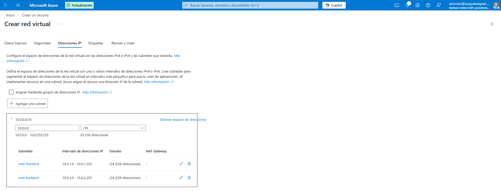
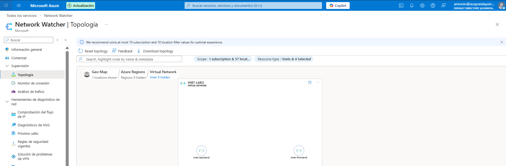
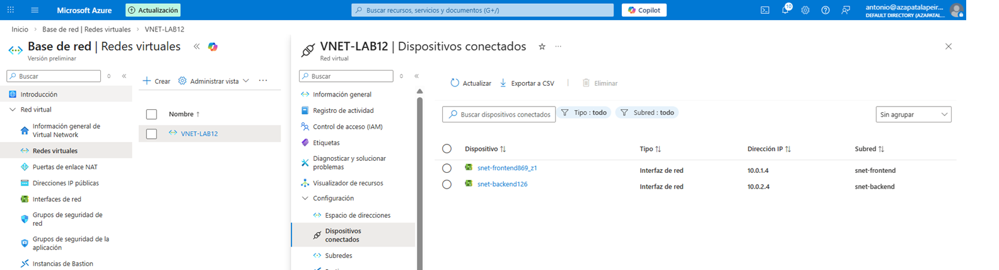

# Lab-13-Estructuracion-de-Redes-Virtuales-VNet-

## Objetivo
Montar una red en Azure con una estructura clara y separada por subredes, para poder aislar servicios “de cara a internet” de servicios internos/datos. La idea es dejar la base preparada para aplicar controles distintos por subred (NSG, routing, Private Endpoints, etc.).

## Qué he hecho en este laboratorio
1. He creado una VNet con direccionamiento propio (10.0.0.0/16).
2. He separado la VNet en dos subredes /24:
   - FrontEnd (zona más “expuesta”, pensada para servicios públicos)
   - BackEnd (zona interna para datos/servicios privados)
3. He desplegado VMs de prueba para comprobar que cada recurso cae donde debe y que la segmentación queda bien definida.

## Configuración utilizada
- VNet: VNET-LAB12 (puedes poner aquí tu nombre real si usas otro)
- Address space: 10.0.0.0/16
- Subnet FrontEnd: 10.0.1.0/24
- Subnet BackEnd: 10.0.2.0/24
- VMs de prueba: 1 en FrontEnd y 1 en BackEnd (solo para validación)

## Evidencias

### 01 - Subredes creadas (FrontEnd / BackEnd)

### 02 - Diagrama / Vista de topología de la VNet

### 03 - VMs desplegadas en su subred correspondiente

> Vista de dispositivos conectados a la VNet mostrando las NICs asociadas a cada subnet (FrontEnd y BackEnd).

## Checklist de verificación
- [x] VNet creada con 10.0.0.0/16
- [x] Subnets /24 correctamente asignadas (FrontEnd y BackEnd)
- [x] VM FrontEnd dentro de su subnet y VM BackEnd dentro de su subnet

## Qué le diría a un cliente / en entrevista
“Separar en subredes es la base para controlar tráfico y reducir riesgos. Puedo aplicar reglas distintas por zona y limitar el movimiento lateral. Luego, sobre esta estructura, es más fácil añadir NSGs, rutas, Bastion o Private Endpoints según el caso.”
